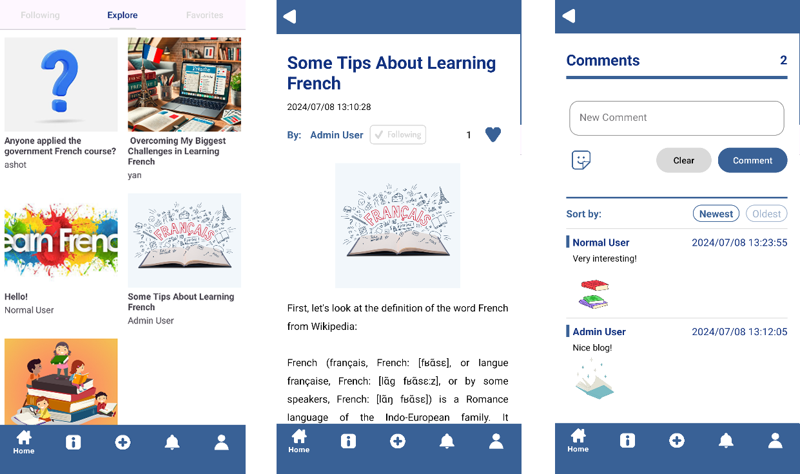
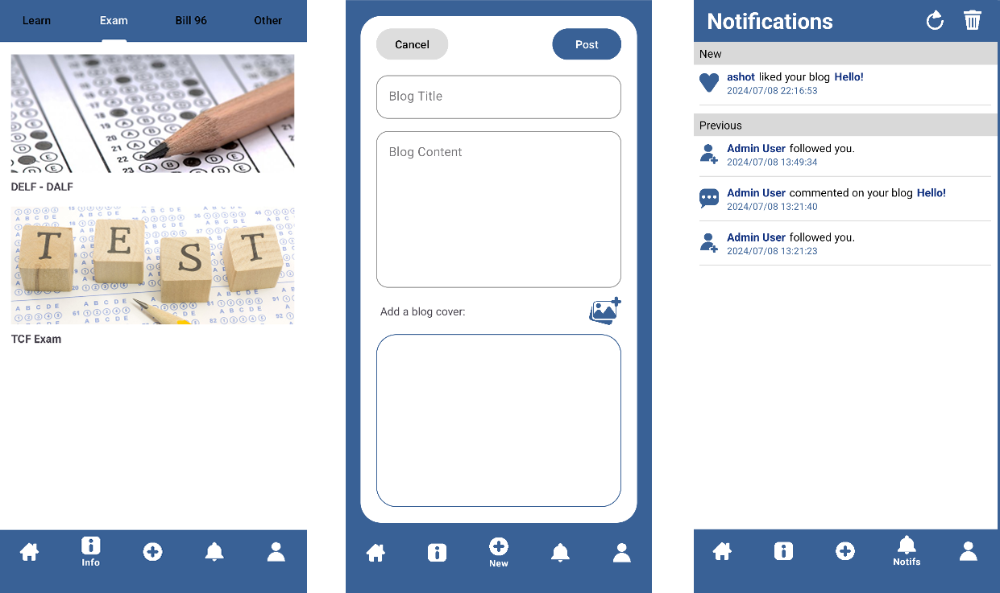
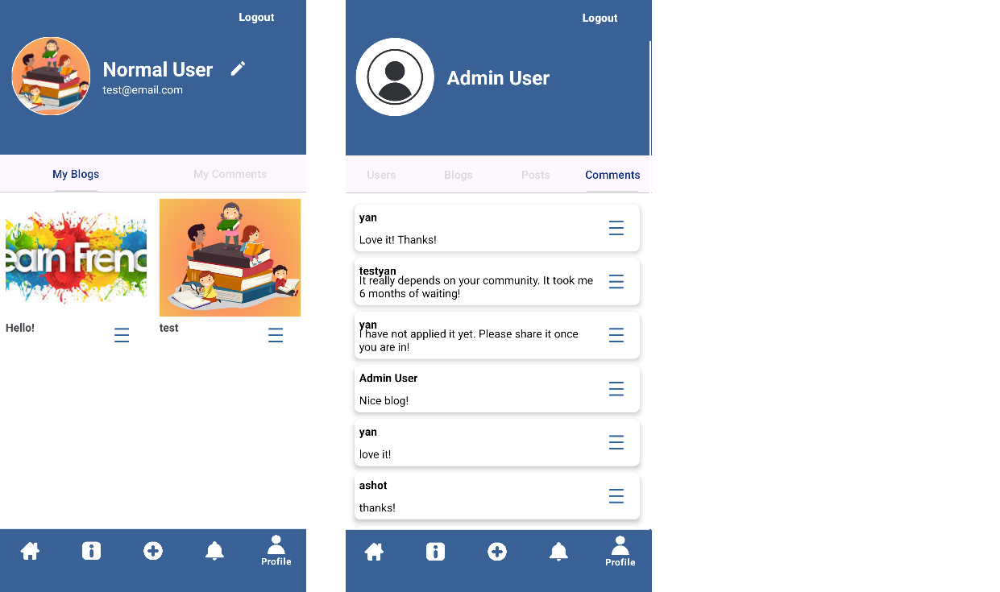
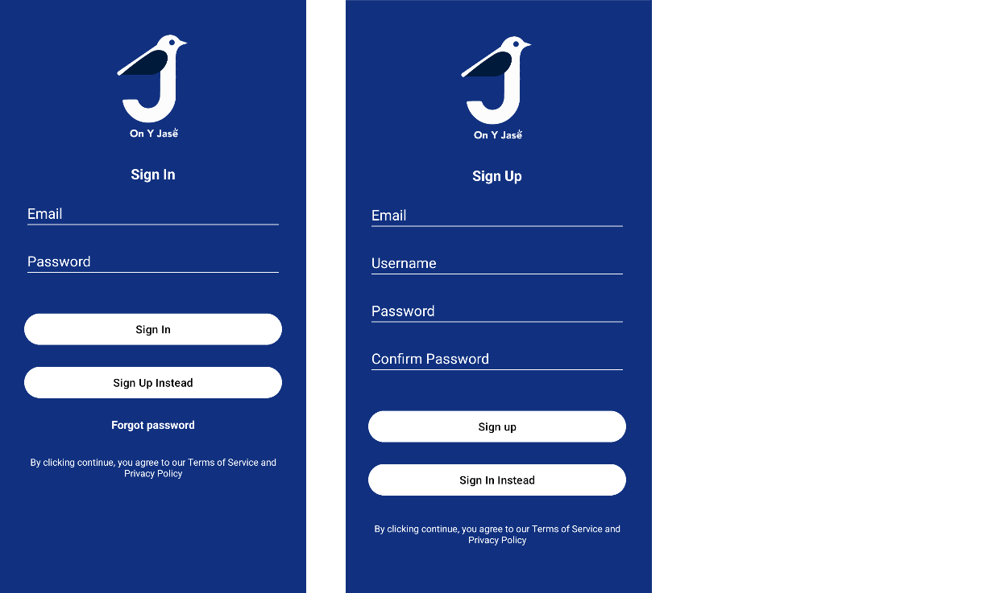

# On Y Jase

## Table of Contents

- [Description](#description)
- [Features of the Application](#features-of-the-application)
    - [Sign In/Sign Up](#sign-insign-up)
    - [Blogs Feed Tab](#blogs-feed-tab)
    - [Posts Feed Tab](#posts-feed-tab)
    - [New Blog/Post Tab](#new-blogpost-tab)
    - [Notificatoins Tab](#notificatoins-tab)
    - [User Profile Tab](#user-profile-tab)
    - [Single Blog Page](#single-blog-page)
    - [Single Post Page](#single-post-page)
- [Technologies Used](#technologies-used)
- [Preview](#preview)

## Description

On Y Jase is an Android mobile application that combines a community platform and a resource hub for French learning, mainly focused on making the French learning experience more manageable and engaging for newcomers in Quebec. It provides users with features that facilitates access to learning materials through regular updates from admin posts, as well as a platform for cummunity interactions through user blogs.

## Features of the Application

#### Sign In/Sign Up

* The app requires a user account to use. Users can sign up using their email.
* Once signed in, the user can use the various features of the app.
* Users can reset their password if they forget it by receiving a password reset email.

#### Blogs Feed Tab

* This tab is divided into 3 subsections, Following, Explore, and Favorites.
* The Following sections displays all blogs from users followed by the user.
* The Explore section displays all blogs.
* The Favorites section displays all blogs liked by the user.

#### Posts Feed Tab

* This tab is divided into 4 subsections, Learn, Exam, Bill96, and Other.
* Each secitions displays the posts updates from the app admin, providing relevant information that could be useful to French learners in Quebec.

#### New Blog/Post Tab

* From this tab, the user can write and post new blogs.
* Admin users can also write and post new admin posts.

#### Notificatoins Tab

* This tab displays all notifications for the user.
* The user is notified for each new like, comment, and follow.
* The notifications tab is divided into two sections, showing new and previous notifications.
* The user can also clear all notifications.

#### User Profile Tab

* This tab displays the user's profile information such as profile picture, username, and account email.
* The user can update their profile picture and username from this page.
* The profile page is further divided into two sections, My Blogs and My Comments, displaying respectively all blogs and comments from the user.
* If the user is an admin, it is instead divided into four sections, All Users, All Blogs, All Posts, and All Comments. The admin user can edit and delete each of them.

#### Single Blog Page

* Clicking on a blog from the Blogs feed tab or the User Profile brings the page displaying the blog.
* On the blog page, users can like the blog and follow the author.
* Users can also leave comments and include stickers in their comments.
* The comment section can be sorted by oldest or newest first.

#### Single Post Page

* Clicking on a post from the Posts feed tab or the Admin Profile brings the page displaying the post.
* Users can read posts as well as click on relevant links leading to more learning resources online.

## Technologies Used

* The app is written using **Java and xml**.
* App related data are stored using **Firebase Firestore**.
* User profile picture, blog cover images, and posts cover images are stored using **Firebase Storage**.
* User authentication is implemented using **Firebase Authentication**.
* **GIPHY API** was used to provide stickers functionalities to blogs' comment section.

## Preview

Here is a preview of the app:

